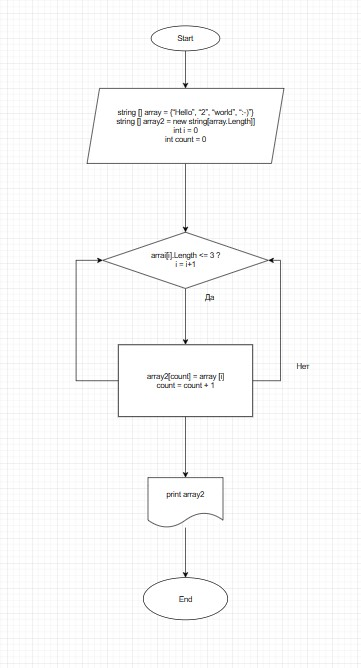

# Алгоритм решения задачи:

## Пояснения к решению:

1. Объявляются два массива: изначальный (вводится пользователем через пробел) и вторый такой же длины. 
2. Далее проверяем каждый отдельный элемент массива на количество символов в нем (<= 3) 
3. В случае если "да", присваиваем значение элемента в массиве 1 значению элемента в массиве 2
4. Если "нет" - возвращаемся в цикл
